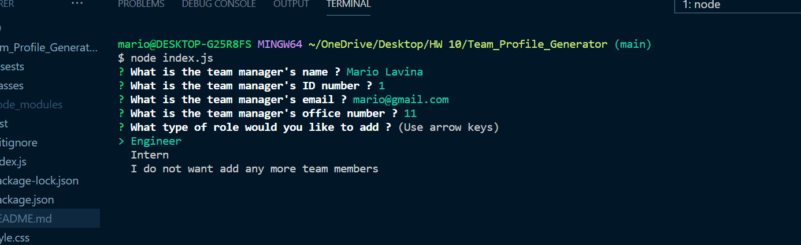
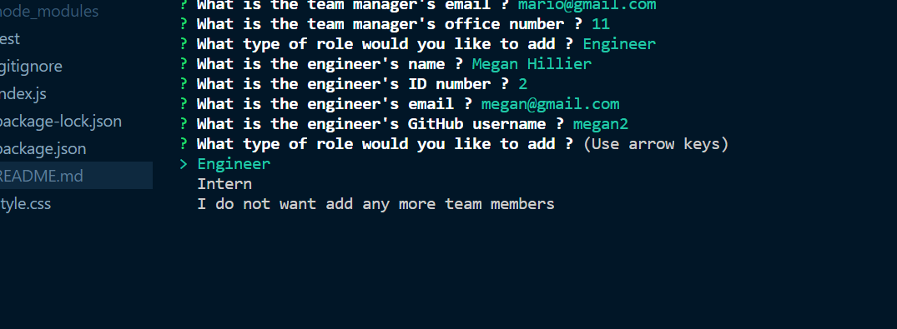
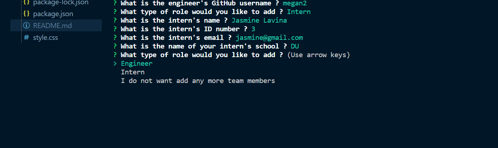
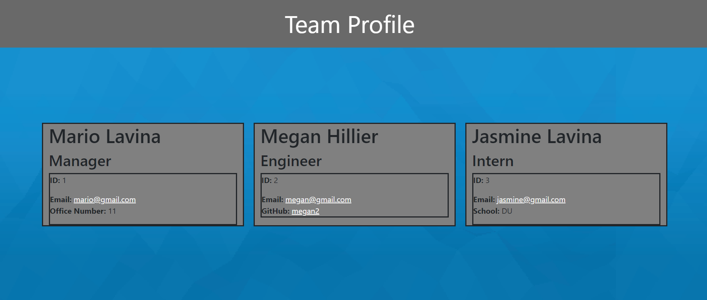
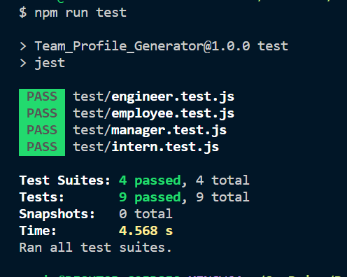

# Team_Profile_Generator

## Table of Contents

[Description](#description)

[Installation](#installation)

[Tests](#tests)

[Screenshots](#screenshots)

[Videos](#videos)

[Questions](#questions)

## Description 

In this back end application, it allows the user to generate a team profile based off of the user's input. Each team member will be into their own individual card and have their name, role in the team and email displayed. If their position is manager, it will include their office number. If their position is engineer, it will include their GitHub username. If their position is Intern, it will include the name of the school that they are attending.   

## Installation 

To install the necessary dependencies, run the following command:

----------
npm i
----------

## Tests 

To run tests, input the following command:

----------------
npm run test
----------------

## Screenshots

## Videos

## Questions 

If you have any questions about the repo, open an issue or contact me directly at mlavina91@gmail.com. 
You can find more of my work at (https://github.comLavina91/).
